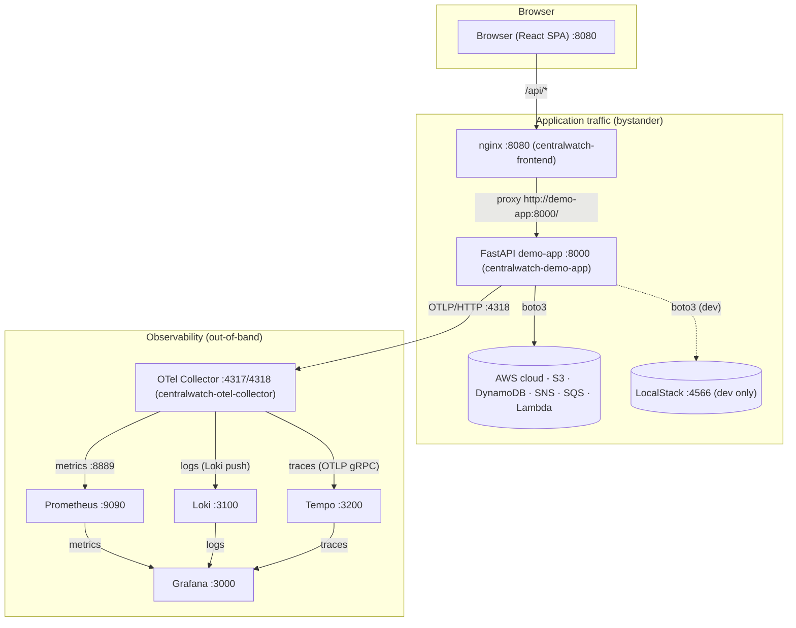
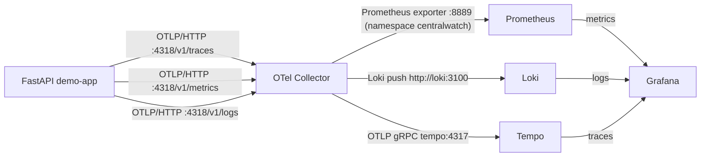

# CENTRALWATCH — END-TO-END PROJECT DOCUMENTATION

**Source of truth:** the actual repository contents (code, compose files, configs, dashboard JSONs, docs). Classification tags used throughout:
- **[CODE]** = directly found in source/config
- **[VALIDATED]** = verified by live runtime checks (real AWS stack, ap-south-2)
- **[CFG]** = configuration-dependent (env-driven)
- **[ASSUMED]** / **[UNKNOWN]** = inferred / not determinable from the repo

---

## 1. FULL CODEBASE DISCOVERY

```
D:\API-Monitoring--1
├── docker-compose.yml              # dev stack (LocalStack) [CODE]
├── docker-compose.aws.yml          # production stack (real AWS) [CODE]
├── .env.aws.example                # real-AWS env template (placeholders) [CODE]
├── .gitignore                      # ignores Lambda artifacts, dist, secrets, etc. [CODE]
├── README.md                       # project overview, quick start, telemetry contract
├── AWS_DEPLOYMENT.md               # AWS resources, IAM policies, production runbook
├── CENTRALWATCH_END_TO_END.md      # end-to-end walkthrough doc [present; not quoted here]
├── CENTRALWATCH_AWS_INTEGRATION_READINESS_REPORT.md  # readiness audit doc [untracked]
├── demo-app/                       # FastAPI backend (Python 3.11)
│   ├── Dockerfile, entrypoint.sh, requirements.txt, .env.example
│   ├── handler.py, lambda.zip, lambda-package/   # generated Lambda artifacts (tracked)
│   └── app/
│       ├── main.py                 # app factory, lifespan, middleware, handlers
│       ├── deps.py                 # DI container + auth dependency
│       ├── config/settings.py      # pydantic-settings (all env-driven)
│       ├── models/                 # user.py, order.py, file_record.py
│       ├── routes/                 # auth, orders, files, images, notifications, queue, simulate
│       ├── schemas/                # pydantic request/response models
│       ├── services/               # boto3 clients + AwsResourceManager + Lambda handler code
│       ├── telemetry/              # instrumentation, metrics, tracing, logging
│       └── utils/                  # aws.py (session/clients/retries), ids.py
├── frontend/dist/                  # prebuilt React SPA (Vite): index.html + assets/*.js|css
├── configs/
│   ├── collector/config.yaml       # OpenTelemetry Collector
│   ├── prometheus/prometheus.yml
│   ├── loki/loki-config.yaml
│   ├── tempo/tempo.yaml
│   ├── nginx/frontend.conf         # SPA static server + /api proxy
│   └── grafana/provisioning/
│       ├── datasources/datasources.yaml
│       └── dashboards/             # dashboards.yaml + 6 dashboard JSONs
└── scripts/                        # start.sh, stop.sh, healthcheck.sh
```

There is **no frontend source** (React/TSX) in the repo — only the built bundle (`frontend/dist`) **[CODE]**. Rebuild instructions for the SPA source are explicitly out of scope per README.

---

## 2. EXECUTIVE SUMMARY

**CentralWatch** is an end-to-end **observability demo**: a small business application (FastAPI + a prebuilt React SPA) that performs **real business workflows against AWS** (DynamoDB, S3, SNS, SQS, Lambda) and, as a complete bystander, emits rich **OpenTelemetry telemetry** — metrics, logs, and traces — through an **OTel Collector** into **Prometheus** (metrics), **Loki** (logs), and **Tempo** (traces), visualized in **Grafana**.

The problem it solves: demonstrating a realistic, observable microservice-style system on a laptop — you can click "create an order", "upload a file", "process an image", then watch the request show up as a Prometheus metric, a Loki log line with a trace ID, and a Tempo waterfall — all driven by the same code against either **LocalStack** (offline dev) or **real AWS** (production mode). The monitoring stack never sits in the request path; application traffic flows `Browser → nginx → FastAPI → AWS`, while telemetry flows out-of-band `FastAPI → OTel Collector → Prometheus/Loki/Tempo → Grafana`.

**What happens from a user action to a result:** e.g., "Create Order" → the SPA `POST /api/orders` → nginx strips `/api` → FastAPI `POST /orders` (auth check: HMAC token) → validates the payload → `dynamodb.put_item` on the `orders` table → returns the created order (201) → simultaneously, the FastAPI instrumentation records an HTTP span/metric, a `business_span("Order Creation")` wraps the DynamoDB call, a structured JSON log line (with `trace_id`/`span_id`) is written, and the collector fans everything out to Prometheus/Loki/Tempo. A few seconds later the order shows up in Grafana dashboards.

**AWS services used:** S3, DynamoDB, SNS, SQS, Lambda (all five via boto3). **Observability stack:** OTel Collector, Prometheus, Loki, Tempo, Grafana, nginx.

---

## 3. COMPLETE ARCHITECTURE

The actual flow derived from code/config **[CODE]**:

```text
                        ┌─────────────────────────────────────────────┐
   Browser (SPA)        │   Application traffic (bystander monitoring) │
      │ :8080            │                                             │
      ▼                 │                                             │
   nginx (frontend)     │   /api/* → http://demo-app:8000/  (prefix stripped)
      │                 │                                             │
      ▼ :8000           ▼                                             │
   FastAPI demo-app ──boto3──▶ AWS (S3 · DynamoDB · SNS · SQS · Lambda)
      │  OTel SDK (OTLP/HTTP :4318)                                   │
      ▼                                                               │
   otel-collector  ──┬─▶ Prometheus (metrics)  ◀── scrapes :8889      │
      (4317/4318)    ├─▶ Loki (logs)                                   │
                     └─▶ Tempo (traces)                                │
                              └────▶ Grafana (:3000) ◀────────────────┘
```



**Components:**

| Component | Purpose | Tech | Container | Port(s) | Protocol | Config source |
|---|---|---|---|---|---|---|
| `frontend` | Serves the prebuilt React SPA; proxies `/api/*` → backend | nginx 1.27-alpine | `centralwatch-frontend` | host 8080 → 80 | HTTP | `configs/nginx/frontend.conf` |
| `demo-app` | FastAPI business app; calls AWS; emits OTel | Python 3.11 + FastAPI 0.115.6 + boto3 | `centralwatch-demo-app` | host 8000 → 8000 | HTTP | `demo-app/app/**`, env |
| `localstack` (dev only) | AWS emulator (S3, DynamoDB, SNS, SQS, Lambda) | localstack/localstack:3.4.0 | `centralwatch-localstack` | host 4566 → 4566 | HTTP | `docker-compose.yml` |
| `otel-collector` | Receives OTLP; fans out to Prometheus/Loki/Tempo | otel/opentelemetry-collector-contrib:0.95.0 | `centralwatch-otel-collector` | host 4317/4318/8889 | gRPC/HTTP/HTTP | `configs/collector/config.yaml` |
| `prometheus` | Metric store + PromQL | prom/prometheus:v2.49.1 | `centralwatch-prometheus` | host 9090 → 9090 | HTTP | `configs/prometheus/prometheus.yml` |
| `loki` | Log store + LogQL | grafana/loki:2.9.4 | `centralwatch-loki` | host 3100 → 3100 | HTTP | `configs/loki/loki-config.yaml` |
| `tempo` | Trace store + TraceQL | grafana/tempo:2.6.1 | `centralwatch-tempo` | host 3200 → 3200 | HTTP/gRPC | `configs/tempo/tempo.yaml` |
| `grafana` | Visualization (dashboards) | grafana/grafana:12.4.0 | `centralwatch-grafana` | host 3000 → 3000 | HTTP | `configs/grafana/provisioning/**` |

**Dependencies** (from compose `depends_on`): `demo-app → otel-collector`; `frontend → demo-app`; `prometheus → otel-collector`. (Dev stack additionally has `demo-app → localstack`.) All services share one bridge network **`centralwatch-network`** [CODE].

---

## 4. COMPLETE PORT MAP

All values extracted from `docker-compose.yml` / `docker-compose.aws.yml` **[CODE]**.

### Host-accessible ports (both stacks)

| Service | Container | Host → Container | Protocol | Purpose | External? |
|---|---|---|---|---|---|
| frontend | `centralwatch-frontend` | 8080 → 80 | HTTP | SPA + API proxy | Yes (localhost:8080) |
| demo-app | `centralwatch-demo-app` | 8000 → 8000 | HTTP | FastAPI (/docs, /healthz…) | Yes (localhost:8000) |
| otel-collector | `centralwatch-otel-collector` | 4317 → 4317 | gRPC | OTLP gRPC receiver | Yes (localhost:4317) |
| otel-collector | `centralwatch-otel-collector` | 4318 → 4318 | HTTP | OTLP HTTP receiver | Yes (localhost:4318) |
| otel-collector | `centralwatch-otel-collector` | 8889 → 8889 | HTTP | Prometheus-format export endpoint | Yes (localhost:8889/metrics) |
| prometheus | `centralwatch-prometheus` | 9090 → 9090 | HTTP | Prometheus UI/API | Yes (localhost:9090) |
| loki | `centralwatch-loki` | 3100 → 3100 | HTTP | Loki API | Yes (localhost:3100) |
| tempo | `centralwatch-tempo` | 3200 → 3200 | HTTP | Tempo API | Yes (localhost:3200) |
| grafana | `centralwatch-grafana` | 3000 → 3000 | HTTP | Grafana UI | Yes (localhost:3000) |

### Dev-stack-only host port

| Service | Container | Host → Container | Protocol | Purpose |
|---|---|---|---|---|
| localstack | `centralwatch-localstack` | 4566 → 4566 | HTTP | AWS emulation endpoint (**absent in AWS stack**) |

### Internal Docker-network ports (not exposed to host)

- `loki` gRPC 9096 (`loki-config.yaml` server.grpc_listen_port) — not published
- `tempo` gRPC 4317 (OTLP, targeted by collector `otlp/tempo` exporter at `tempo:4317`)
- `otel-collector` internal telemetry 8888 (`collector` telemetry.metrics.address)
- `demo-app` 8000 (internal target of nginx proxy `http://demo-app:8000/`)
- `prometheus` 9090 (internal target for Grafana datasource `http://prometheus:9090`)

---

## 5. HOW TO RUN THE PROJECT

### A. Development / LocalStack mode

Prerequisites: Docker + Docker Compose v2 (README). No pre-built images, no pre-created resources (the app auto-provisions against LocalStack).

```bash
# 1. (optional) environment — docker-compose.yml ships dev defaults; AUTH_TOKEN_SECRET has a dev default
cp .env.example .env            # repo root only if you need overrides

# 2. Build + start all 8 services
docker compose up -d --build

# 3. Health
./scripts/healthcheck.sh            # mode localstack (default)
curl -s http://localhost:8000/healthz

# 4. Logs
docker compose logs -f demo-app

# 5. Restart
docker compose restart demo-app

# 6. Stop
docker compose down                # keep volumes; add -v to wipe them
```

In this mode `AWS_ENDPOINT_URL=http://localstack:4566`, `AWS_PROVISION_RESOURCES=true` (auto-create + reconcile loop), creds `test/test`, addressing style `path`, region `us-east-1` [CODE].

### B. Real AWS mode

```bash
# 1. Pre-create AWS resources (see AWS_DEPLOYMENT.md §2 + §3): S3 bucket, 3 DynamoDB
#    tables (users + email-index GSI), SNS topic, SQS queue, Lambda function, 2 IAM roles.

# 2. Environment
cp .env.aws.example .env         # then fill: AWS_REGION, AWS creds, resource names,
                                 # AUTH_TOKEN_SECRET, GRAFANA_ADMIN_PASSWORD (REQUIRED, no defaults)

# 3. Start (standalone, or as an override of the dev file):
docker compose --env-file .env -f docker-compose.aws.yml up -d --build
#   or: docker compose --env-file .env -f docker-compose.yml -f docker-compose.aws.yml up -d

# 4. Health
./scripts/healthcheck.sh aws
curl -s http://localhost:8000/readyz      # {"status":"ready","aws":"reachable",...}

# 5. Logs / stop
docker compose --env-file .env -f docker-compose.aws.yml logs -f demo-app
docker compose --env-file .env -f docker-compose.aws.yml down
```

**Key differences (LocalStack vs Real AWS)** [CODE]:

| Aspect | LocalStack (dev) | Real AWS (prod) |
|---|---|---|
| `AWS_ENDPOINT_URL` | `http://localstack:4566` | empty → SDK default regional endpoints |
| Credentials | `test`/`test` | empty → standard credential chain (env, ~/.aws, role) or `.env` static keys |
| `AWS_PROVISION_RESOURCES` | `true` (create idempotently + reconcile loop + Lambda warm-up) | `false` (validate every resource at startup, **fail fast** if missing) |
| `AWS_S3_ADDRESSING_STYLE` | `path` | `auto` |
| Region | `us-east-1` | e.g. `ap-south-2` (env) |
| Lambda | created by app (LocalStack sidecar; needs Docker socket) | pre-created by operator; app only `lambda:GetFunction`/`lambda:InvokeFunction` |
| Containers | 8 (incl. `localstack`) | 7 (no `localstack`) |

---

## 6. ENVIRONMENT VARIABLES

Defined in `demo-app/app/config/settings.py` **[CODE]**. Secrets shown as `<REDACTED>`.

| Variable | Purpose | Required? | LocalStack value | AWS value | Used by |
|---|---|---|---|---|---|
| `SERVICE_NAME` | OTel service.name / log service | yes (default) | `centralwatch-demo-app` | same | telemetry |
| `SERVICE_VERSION` | OTel service.version | no | `1.0.0` | same | telemetry |
| `ENVIRONMENT` | deployment.environment label | no | `development` | `production` | telemetry label |
| `LOG_LEVEL` | logging level | no | `INFO` | `INFO` | logging |
| `AWS_ENDPOINT_URL` | custom endpoint | no | `http://localstack:4566` | empty (must be) | all boto3 clients |
| `AWS_REGION` | region | yes | `us-east-1` | `ap-south-2` | all clients |
| `AWS_ACCESS_KEY_ID` | static creds | no | `test` | `<REDACTED>` or empty (chain) | session |
| `AWS_SECRET_ACCESS_KEY` | static creds | no | `test` | `<REDACTED>` or empty | session |
| `AWS_SESSION_TOKEN` | temp creds | no | empty | empty | session |
| `AWS_S3_ADDRESSING_STYLE` | S3 addressing | no | `path` | `auto` | S3 client |
| `AWS_PROVISION_RESOURCES` | provision vs validate | yes | `true` | `false` | startup |
| `LAMBDA_ROLE_ARN` | Lambda role (provisioning only) | no | `arn:aws:iam::000000000000:role/...` | `<ACCOUNT_ID>` ARN | provisioning |
| `S3_BUCKET` | bucket name | yes | `centralwatch-files` | `<YOUR_BUCKET>` | S3 |
| `DYNAMODB_USERS_TABLE` | users table | yes | `users` | `<YOUR_TABLE>` | DynamoDB |
| `DYNAMODB_ORDERS_TABLE` | orders table | yes | `orders` | `<YOUR_TABLE>` | DynamoDB |
| `DYNAMODB_FILES_TABLE` | files table | yes | `files` | `<YOUR_TABLE>` | DynamoDB |
| `SNS_TOPIC` | topic name | yes | `centralwatch-notifications` | `<YOUR_TOPIC>` | SNS |
| `SQS_QUEUE` | queue name | yes | `centralwatch-queue` | `<YOUR_QUEUE>` | SQS |
| `LAMBDA_FUNCTION` | function name | yes | `centralwatch-image-processor` | `<YOUR_FUNCTION>` | Lambda |
| `AUTH_TOKEN_SECRET` | HMAC token signing key | **yes, no default** (fail-fast validator) | dev default in compose | strong random | auth |
| `TOKEN_TTL_SECONDS` | token expiry | no | `86400` | `86400` | auth |
| `OTEL_EXPORTER_OTLP_ENDPOINT` | collector base URL | yes | `http://otel-collector:4318` | same | telemetry |
| `OTEL_METRICS_EXPORT_INTERVAL_MS` | metric push interval | no | `15000` | `15000` | telemetry |
| `INIT_RECONCILE_INTERVAL_SECONDS` | reconcile loop period | no | `60` | `60` | dev startup |
| `LOCALSTACK_WAIT_TIMEOUT_SECONDS` | LocalStack wait timeout | no | `120` | `120` (inert — only read when endpoint set) | entrypoint/lifespan |
| `SIMULATE_TIMEOUT_SECONDS` | `/simulate/timeout` sleep | no | `5` | `5` | simulate route |
| `SIMULATE_RETRY_ATTEMPTS` | retry demo attempts | no | `3` | `3` | simulate route |
| `GRAFANA_ADMIN_USER` / `GRAFANA_ADMIN_PASSWORD` | Grafana bootstrap creds | yes (AWS compose; password no default) | `admin`/`admin` | `<REDACTED>` | docker-compose.aws.yml |
| `DEMO_APP_IMAGE` | pull image instead of build | no | n/a | n/a | docker-compose.aws.yml |
| `DOCKER_SOCK_PATH` | Docker socket for LocalStack Lambda | no (dev) | `/run/host-services/docker.proxy.sock` | n/a | docker-compose.yml |
| `SERVICE_NAME` etc. in `docker-compose.yml` | `ENVIRONMENT` default `development`, `AUTH_TOKEN_SECRET` dev default | — | — | — | compose |

---

## 7. AWS ARCHITECTURE

All via boto3, client construction in `utils/aws.py::make_client` (endpoint only when `AWS_ENDPOINT_URL` set; S3 addressing style configurable; retries `{"max_attempts": 3, "mode": "standard"}`, connect 5s, read 30s; Lambda client read timeout 300s) **[CODE]**.

### S3
- **Bucket:** `S3_BUCKET` (default `centralwatch-files`) [CODE].
- **Stored:** file uploads under `uploads/<file_id>/<name>`; image-processing objects under `images/<uuid hex>.<ext>` [CODE].
- **Upload flow:** `routes/files.py` reads multipart → `s3.upload()` = `put_object(Bucket, Key, Body, ContentType, Metadata={"original_filename": name})` → returns ETag → metadata written to DynamoDB `files` table [CODE].
- **Download flow:** no direct object download route; `GET /files/{file_id}` returns metadata **plus a presigned URL** (`generate_presigned_url("get_object", ExpiresIn=3600)`) [CODE].
- **Delete flow:** `DELETE /files/{file_id}` → `delete_object` then DynamoDB `delete_item` [CODE].
- **Permissions required (app role):** `s3:HeadBucket` + `s3:GetObject/PutObject/DeleteObject` on bucket ARNs; `s3:ListAllMyBuckets` on `*` (service-level action) [AWS_DEPLOYMENT.md].

### DynamoDB (`dynamodb_service.py` + `aws_resources.py::_table_definitions`) [CODE]

| Table | PK | Type | Sort key | GSIs | Billing mode |
|---|---|---|---|---|---|
| `users` | `user_id` | S (HASH) | — | `email-index` on `email` (S, HASH), Projection ALL | PAY_PER_REQUEST |
| `orders` | `order_id` | S (HASH) | — | — | PAY_PER_REQUEST |
| `files` | `file_id` | S (HASH) | — | — | PAY_PER_REQUEST |

**Attributes written (from models + auth_service):**
- `users`: `user_id` (PK), `email` (GSI key), `name`, `created_at`, `password_hash` (added by `AuthService.register`, **not** part of the `User` dataclass) [CODE]
- `orders`: `order_id`, `user_id`, `items` (list of `{product_id, name, quantity, unit_price}`), `total`, `status` ("created"), `created_at` [CODE]
- `files`: `file_id`, `name`, `size` (int), `content_type`, `bucket`, `key`, `created_at` [CODE]

**Operations:** `put_item`, `get_item`, `delete_item`, `scan(limit=100)`, and `query_by_email` (`Query` on `email-index` with `KeyConditionExpression "#email = :email"`) [CODE]. The users GSI name `email-index` is **hardcoded** and verified (name + key schema) at real-AWS startup validation [CODE].

### SNS (`sns_service.py`) [CODE]
- **Topic:** `SNS_TOPIC` (default `centralwatch-notifications`).
- **Resolution:** `list_topics` (paginator) → match by name; **idempotent `create_topic` fallback** (dev convenience; never runs in real-AWS happy path).
- **Publish:** `publish(TopicArn, Subject, Message, MessageAttributes={channel, recipient})`, wrapped in a `"Notification Workflow"` span; counter `notifications_sent_total{channel,status="ok"}`.
- **Channels:** `email`, `sms` (from routes), `image-processor` (from the Lambda handler) [CODE].
- No SNS subscriptions are created anywhere — the app **only publishes** [CODE].

### SQS (`sqs_service.py`) [CODE]
- **Queue:** `SQS_QUEUE` (default `centralwatch-queue`); resolve via `get_queue_url`, `create_queue` fallback.
- **Send:** `send_message(MessageBody)` → returns MessageId.
- **Receive+delete:** `receive_message(MaxNumberOfMessages=min(max,10), WaitTimeSeconds=2)` → `delete_message_batch` for all received (receive is **destructive** by design) [CODE].

### Lambda (`lambda_service.py` + `aws_resources.py::LAMBDA_HANDLER_CODE`) [CODE]
- **Function:** `LAMBDA_FUNCTION` (default `centralwatch-image-processor`), runtime `python3.11`, arch `x86_64`, timeout 30 s, memory 256 MB, handler `handler.lambda_handler`, environment `AWS_REGION` (plus endpoint/keys only in LocalStack provision mode).
- **Invocation (sync):** `lambda.invoke(FunctionName, Payload=json.dumps({bucket, key, topic_arn, traceparent}))` (default `RequestResponse`). Payload parsed by `_parse_invoke`: expects `{"statusCode": 200, "body": "<json string>"}`.
- **Handler behavior:** `s3.get_object(bucket, key)` → `time.sleep(0.5)` (simulated processing) → `sns.publish(TopicArn, Subject="Image processed", Message=result, MessageAttributes={channel: "image-processor", processing_id})` → returns `{"statusCode": 200, "body": json.dumps({status, processing_id, bucket, key, size_bytes, traceparent, notification: "published"})}`. Honors `warmup` flag (`{"statusCode":200,"body":{"status":"warm"}}`).
- **Warm-up:** `warm_up()` invokes with `{"warmup": true}` (background task, 8 s after start, provision mode only).

**IAM (documented in AWS_DEPLOYMENT.md, not modified):**
- **CentralWatch app user (`centralwatch-app`):** S3 (Get/Put/Delete/HeadBucket on bucket ARNs + `ListAllMyBuckets` `*`), DynamoDB (GetItem/PutItem/DeleteItem/Query/Scan/DescribeTable on the 3 tables + `users/index/email-index`), SNS (`Publish` on topic ARN + `ListTopics` `*`), SQS (`GetQueueUrl/SendMessage/ReceiveMessage/DeleteMessageBatch` on queue ARN), Lambda (`InvokeFunction`/`GetFunction` on function ARN), plus a `ProvisioningOnly` statement (CreateBucket/CreateTable/CreateTopic/CreateQueue/CreateFunction, region-conditioned) only for `AWS_PROVISION_RESOURCES=true`.
- **Lambda execution role:** `s3:GetObject` on `centralwatch-files/images/*`, `sns:Publish` on the topic ARN, CloudWatch Logs (CreateLogGroup/Stream, PutLogEvents). Trust policy allows `lambda.amazonaws.com`.
- **Note on `*`:** `sns:ListTopics` and `s3:ListAllMyBuckets` are service-level actions that **cannot** be ARN-scoped — they require `"Resource": "*"` [AWS_DEPLOYMENT.md]. [VALIDATED] live: the app user could `list_buckets` but lacked `HeadBucket` on the real bucket (403) until fixed — confirming the policy distinction.

---

## 8. END-TO-END BUSINESS WORKFLOWS

### Authentication
Register → `POST /auth/register` (public) → `AuthService.register`: lowercases email → **Query** `users` via `email-index` (409 if exists) → `User(user_id="usr_<12hex>", email, name, created_at)` + `password_hash` (PBKDF2-HMAC-SHA256, 100 000 iterations, `salt$digest`) → **PutItem** `users`. Login → `POST /auth/login` → **Query** by email → verify password → HMAC-SHA256 token `base64(user_id.expires.signature)` (TTL `TOKEN_TTL_SECONDS`) → `{token, token_type:"bearer", expires_in, user}`. Profile → `GET /auth/profile` (Bearer) → verify token → **GetItem** by `user_id`. Spans: `"User Registration"`, `"User Login"` [CODE]. All protected routers use `require_auth` (Deps → `get_profile`) [CODE].

### Create Order
SPA/curl → `POST /orders` (auth) → `OrderCreate` validation (`items` min 1; each item `quantity ≥ 1`, `unit_price ≥ 0`) → total computed → `Order(order_id="ord_<12hex>", user_id, items, total, status="created", created_at)` → `dynamodb.put_item` (orders) inside `business_span("Order Creation")` → `orders_created_total{status="created"}++` → 201 with order JSON. `GET /orders` → scan(limit=50); `GET /orders/{id}` → GetItem (404 if missing) [CODE].

### File Upload
`POST /files/upload` (auth, multipart) → read body → key `uploads/<file_id>/<name>` → `s3.put_object` (ContentType + metadata) in a thread → `FileRecord` written to `files` table → `files_uploaded_total{status="ok"}++` → 201 metadata JSON. `GET /files/{id}` → presigned download URL. `DELETE /files/{id}` → S3 delete + DynamoDB delete [CODE].

### Notification
`POST /notifications/email` or `/notifications/sms` (auth) → `sns.publish(channel, recipient, subject, message)` inside `"Notification Workflow"` span → `notifications_sent_total{channel,status="ok"}++` → `{message_id, channel, topic_arn}` [CODE].

### Queue
`POST /queue/send` (auth, `{body}`) → `sqs.send_message` → `{message_id, queue_url}`. `GET /queue/messages` → `receive_message` (max 10, wait 2 s) → `delete_message_batch` → `{messages:[{message_id, body}], received:N}` [CODE].

### Image Processing (special detail)
`POST /images/process` (auth, multipart) → `LambdaService.process_image` under parent span `"Image Processing Workflow"`:
1. key `images/<uuid4 hex>.<ext>` (ext lowercased, max 8 chars; default `bin`)
2. `s3.put_object` (metadata `original_filename`)
3. payload `{bucket, key, topic_arn, traceparent}` (traceparent = W3C header of current span)
4. `lambda.invoke` (sync, 300 s client read timeout)
5. Lambda: `s3.get_object` → sleep 0.5 s → `sns.publish` (channel `image-processor`) → returns `{statusCode:200, body:{status:"processed", …, notification:"published"}}`
6. `_parse_invoke` (raises if `FunctionError` or non-200) → `images_processed_total{status="ok"}++` → 200 response [CODE]. **[VALIDATED]** live against real AWS.

---

## 9. COMPLETE API REFERENCE

Auth = `Authorization: Bearer <token>` required (except public). All from `routes/*.py` [CODE].

| Method | Endpoint | Purpose | Auth | Request | Response | AWS service |
|---|---|---|---|---|---|---|
| POST | `/auth/register` | Register user | public | `{email, password(≥6), name}` | 201 `{user_id,email,name,created_at}` | DynamoDB |
| POST | `/auth/login` | Login, get token | public | `{email, password}` | `{token, token_type, expires_in, user}` | DynamoDB |
| GET | `/auth/profile` | Current user | Bearer | — | `{user_id,email,name,created_at}` | DynamoDB |
| POST | `/orders` | Create order | Bearer | `{user_id, items:[{product_id,name,quantity≥1,unit_price≥0}]}` | 201 `{order_id,user_id,items,total,status,created_at}` | DynamoDB |
| GET | `/orders` | List orders | Bearer | — | `{orders:[…], count}` | DynamoDB (Scan) |
| GET | `/orders/{order_id}` | Get order | Bearer | — | order JSON / 404 | DynamoDB |
| POST | `/files/upload` | Upload file | Bearer | multipart `file` | 201 `{file_id,name,size,content_type,bucket,key,created_at}` | S3 + DynamoDB |
| GET | `/files/{file_id}` | Metadata + download URL | Bearer | — | `FileOut` + `download_url` (presigned) | DynamoDB + S3 |
| DELETE | `/files/{file_id}` | Delete file | Bearer | — | `{file_id, deleted:true}` | S3 + DynamoDB |
| POST | `/notifications/email` | Email notification | Bearer | `{recipient, subject?, message}` | `{message_id, channel, topic_arn}` | SNS |
| POST | `/notifications/sms` | SMS notification | Bearer | same | `{message_id, channel:"sms", topic_arn}` | SNS |
| POST | `/queue/send` | Enqueue message | Bearer | `{body}` | `{message_id, queue_url}` | SQS |
| GET | `/queue/messages` | Receive + delete | Bearer | — | `{messages:[{message_id,body}], received}` | SQS |
| POST | `/images/process` | Process image | Bearer | multipart `file` | `{status, processing_id, bucket, key, size_bytes, notification}` | S3 → Lambda → SNS |
| GET | `/simulate/error` | Deliberate 500 | Bearer | — | 500 `SimulatedFailure` | none |
| GET | `/simulate/timeout` | Slow request | Bearer | — | `{status, slept_for_seconds}` (sleeps `SIMULATE_TIMEOUT_SECONDS`) | none |
| GET | `/simulate/s3-error` | AWS 502 demo | Bearer | — | 502 (put_object to invalid bucket) | S3 |
| GET | `/simulate/retry` | Retry demo | Bearer | — | `{status, attempts, buckets}` (2 simulated throttles then success) | S3 |
| GET | `/healthz` | Liveness | public | — | `{status, service, version}` | none |
| GET | `/livez` | Liveness | public | — | `{status:"alive"}` | none |
| GET | `/readyz` | Readiness (AWS) | public | — | `{status:"ready",aws:"reachable",buckets:N}` or 503 | S3 (list_buckets) |
| GET | `/docs` | Swagger UI | public | — | OpenAPI docs | — |

Error mapping (`utils/aws.py::aws_error_response`): no creds → 500 `AWSCredentialsError`; connection errors → 503; `NoSuchBucket/NoSuchKey/ResourceNotFoundException` → 404; `AccessDenied*` → 403; throttling → 429; `ValidationException` → 400; other ClientError → 502 [CODE].

---

## 10. FRONTEND DOCUMENTATION

The frontend is a **prebuilt React SPA** (Vite, dark theme — `index.html` has `class="dark"`) served by nginx at **http://localhost:8080**. It uses axios with `baseURL` `/api` (README) and the nginx proxy strips `/api` so requests hit the backend routes described in §9 (same-origin → no CORS) [CODE].

Evidence from the bundle (UI labels) shows the SPA surface **[CODE]**: **Sign in / Register** ("Welcome back!", "Email", "Password", "Token type"), **Dashboard** ("Dashboard", "Overview and quick actions"), **Orders** ("Orders"), **Files** ("Files", "Upload a file", "Upload and manage files (S3)", "Upload to S3", "Uploaded", "Uploading…"), **Notifications** ("Notifications", "Send email / SMS (SNS)", "Send via SNS", "Send", "Sending…"), **Queue** ("Queue", "Send to queue", "Queue message sent", "Receive messages", "Queue is empty"), **Image processing** ("Process image", "Processing ID", "Processing…"), plus simulation/error strings.

End-user flow: open `http://localhost:8080` → Sign in (or register) → dashboard with quick actions → each action calls the corresponding `/api/...` endpoint (orders, files/upload, notifications/email|sms, queue/send + queue/messages, images/process) with the Bearer token stored from login. Expected result: the created resource appears in the UI; telemetry for every action shows up in Grafana within seconds. Responsive/mobile behavior: not determinable from the minified bundle without running it — **[UNKNOWN]**. Theme: dark by default [CODE]. Rebuilding the SPA is out of scope of this repo (no source) [README].

---

## 11. GRAFANA DOCUMENTATION

- **URL/port:** http://localhost:3000 — **login:** `GF_SECURITY_ADMIN_USER`/`GF_SECURITY_ADMIN_PASSWORD` (`admin`/`admin` dev default; AWS compose requires `GRAFANA_ADMIN_PASSWORD`, no default). Sign-up disabled [CODE].
- **Provisioning:** `configs/grafana/provisioning/` — datasources auto-created (`datasources.yaml`): **Prometheus** (default, `http://prometheus:9090`, POST), **Loki** (`http://loki:3100`), **Tempo** (`http://tempo:3200`, GET). Dashboards auto-loaded every 30 s from the **CentralWatch** folder (`dashboards.yaml` → folder `CentralWatch`, `allowUiUpdates: true`) [CODE].

Six dashboards (Grafana 12.4 schema v41, timezone browser, template vars `$job/$instance/$service/$environment` from `label_values(...)` + `$level`/`$traceid` where relevant) [CODE]:

### CentralWatch – Overview (Prometheus)
- **Traffic row:** Requests/sec (`sum(rate(..._count))`), Avg Latency (`sum(rate(..._sum))/sum(rate(..._count))`), P95/P99 (`histogram_quantile` on `..._bucket`), Error Rate, Success Rate; Request Rate by Status Code (timeseries); Latency Percentiles (0.5/0.95/0.99).
- **Business Activity row:** stat cards Orders / Files / Images / Notifications / Retries; Business Counter Rates (timeseries).

### CentralWatch – API Monitoring (Prometheus)
- **Traffic by Dimension:** Requests by Route (`sum by (http_target)` rate), Requests by Method, Latency by Route (P95 histogram_quantile), Status Codes.
- **Quality:** Error Rate, Histogram (bucket rate), Top Slow APIs (`topk(10, max by (http_target) ...)`).

### CentralWatch – AWS Services (Tempo — TraceQL)
- Tables: **S3 Operations** (`name =~ "S3.PutObject|S3.DeleteObject|S3.ListBuckets"`), **Lambda Invocations** (`name = "Lambda.Invoke"`), **SNS Publishes** (`name =~ "centralwatch-.* send"`), **SQS Messages** (`SQS.SendMessage|SQS.ReceiveMessage|SQS.DeleteMessageBatch`), **DynamoDB Operations** (`DynamoDB.PutItem|GetItem|Query|Scan|DeleteItem`), each `| select(name, status, duration)`; **AWS Trace Waterfall** (`trace:id = "${traceId}"`).

### CentralWatch – Business Metrics (Prometheus)
- Totals row: stat cards for `centralwatch_orders_created_total`, `centralwatch_files_uploaded_total`, `centralwatch_images_processed_total`, `centralwatch_notifications_sent_total`, `centralwatch_retry_attempts_total`; Business Counter Rates.
- Breakdowns: Notifications by Channel (`sum by (channel)`), Images by Status, Retries by Operation.

### CentralWatch – Tracing (Tempo — TraceQL)
- Recent Traces (select name/status/duration), Slowest Traces (`duration > 1s`), Trace Waterfall (`trace:id`), AWS Services segments (`S3.*|SQS.*|DynamoDB.*|Lambda.*|centralwatch-.*`), Business Workflows (`User Registration|User Login|Order Creation|Notification Workflow|Image Processing Workflow|Retr…`).

### CentralWatch – Logs (Loki — LogQL)
- Total Log Lines (`sum(count_over_time({job=~"$job"}[$__range]))`), Recent Logs (`{job=~"$job", level=~"$level"}`), Errors (`level="ERROR"`), Warnings (`level=~"WARN.*"`), Logs by TraceID (`{job=~"$job"} | json | traceid=~"$traceid"`), Logs by Endpoint (`| json endpoint="attributes.endpoint"`).

**[VALIDATED]** live: dashboards + datasources provisioned; metrics/logs/traces queryable (Prometheus API, Loki query_range, Tempo /api/search all returned CentralWatch data).

---

## 12. OBSERVABILITY ARCHITECTURE

Verified from `instrumentation.py` + `configs/collector/config.yaml` **[CODE]**:

```
FastAPI ──OTLP/HTTP (4318)──▶ otel-collector
        /v1/traces ───────────▶ Tempo (tempo:4317, gRPC)
        /v1/metrics ──────────▶ Prometheus exporter :8889 (namespace "centralwatch")
        /v1/logs ─────────────▶ Loki (http://loki:3100/loki/api/v1/push)
```



- **Resource attributes** on every signal: `service.name`, `service.version`, `deployment.environment`, `cloud.provider="aws"`, `cloud.region`, `host.name`, `container.id`, `telemetry.sdk.*` [CODE].
- Collector pipelines all use `memory_limiter` (75%/15%) + `batch` (8192/5 s/10240); `debug` exporter enabled for all pipelines; a commented-out `otlp` backend exporter template is present but **not active** [CODE].
- Prometheus exporter: `send_timestamps`, `metric_expiration: 5m`, and **`resource_to_telemetry_conversion: enabled`** — this is what turns `deployment.environment` into the `deployment_environment` label (and `service.name` into `service_name`) [CODE].
- Prometheus scrapes `otel-collector:8889/metrics` every 5 s with static label `service="centralwatch-collector"` [CODE].

---

## 13. METRIC CONTRACT

Prometheus names = `centralwatch_` namespace (collector) + app names. **Business counters** (`telemetry/metrics.py`, meter `centralwatch-demo-app.business`) [CODE]:

| Prometheus name | App name | Type | Labels | Meaning | Code |
|---|---|---|---|---|---|
| `centralwatch_orders_created_total` | `orders.created_total` | Counter | `status` | orders created | routes/orders.py |
| `centralwatch_files_uploaded_total` | `files.uploaded_total` | Counter | `status` | file uploads | routes/files.py |
| `centralwatch_images_processed_total` | `images.processed_total` | Counter | `status` | images processed | lambda_service.py |
| `centralwatch_notifications_sent_total` | `notifications.sent_total` | Counter | `channel`, `status` | notifications sent | sns_service.py |
| `centralwatch_retry_attempts_total` | `retry.attempts_total` | Counter | `operation` | simulated retries | s3_service.py |

**Automatic HTTP metrics** (FastAPI/ASGI instrumentation, same namespace): `centralwatch_http_server_duration_milliseconds_bucket|sum|count` with labels `http_method`, `http_status_code`, `http_target`, plus resource-derived `deployment_environment`, `service_name`, `container_id`, `host_name`, `cloud_region`, etc. **[CODE, VALIDATED]** — all six metric families were present with live data (e.g. `centralwatch_images_processed_total{status="ok"} = 1`).

---

## 14. LOG CONTRACT

`telemetry/logging.py` — JSON to stdout (`JsonFormatter`) **and** OTLP logs → Loki (`LoggingHandler`) [CODE].

Fields: `timestamp` (ISO-8601 UTC, ms), `level` (Python level names — **uppercase**: INFO/ERROR/WARN), `logger`, `message`, `service.name`; `trace_id` (32 hex) / `span_id` (16 hex) from the active span when valid; optional extras: `endpoint`, `http.method`, `status_code`, `duration_ms`, `aws.service`, `aws.operation`, `retry.count`, `bucket.name`, `table.name`, `queue.name`, `topic.name`, `channel`, `user.id`; on exceptions `exception.type`/`exception.message` [CODE].

Every request is logged by `RequestLoggingMiddleware` (`"%s %s -> %d (%.1f ms)"`, ERROR for ≥500, INFO otherwise), with `http.status_code` re-attached to the OTel span (error-path fix documented in `main.py`) [CODE]. Loki label extraction: `job` = service.name (via `loki` exporter), `level`; JSON fields queryable with `| json` (e.g. `| json | traceid=~"..."`) — see Logs dashboard [CODE]. **[VALIDATED]** live: `{job="centralwatch-demo-app"}` stream returned structured lines with traceid/spanid.

---

## 15. TRACE CONTRACT

Service name: `centralwatch-demo-app` [CODE].

**Auto spans (instrumentation):** HTTP server spans (FastAPI ASGI) for every request; **botocore AWS spans** per operation: `S3.PutObject`, `S3.GetObject`, `S3.DeleteObject`, `S3.ListBuckets`, `DynamoDB.PutItem`, `DynamoDB.GetItem`, `DynamoDB.Query`, `DynamoDB.Scan`, `DynamoDB.DeleteItem`, `SQS.SendMessage`, `SQS.ReceiveMessage`, `SQS.DeleteMessageBatch`, `Lambda.Invoke`, and SNS publish (naming convention `centralwatch-<topic> send`, per the AWS Services dashboard query) [CODE].

**Manual business spans** (`tracing.py::business_span`, attributes via `aws_attributes` → `application.name`, `aws.service`, `aws.operation`, plus `table.name`/`bucket.name`/`topic.name`/`channel`/`endpoint`): `User Registration`, `User Login`, `Order Creation`, `Notification Workflow`, `Image Processing Workflow` [CODE].

**Retry spans** (`utils/aws.py::retry_operation`, tracer `centralwatch-demo-app.retry`): parent `Retry Operation` (attrs `operation`, `retry.max_attempts`) with per-attempt children `Retry Attempt N` (attrs `operation`, `retry.count`, `retry.max_attempts`); parent marked ERROR after last failure [CODE].

**Cross-service propagation:** the app passes the W3C `traceparent` of the current span into the Lambda payload (`lambda_service.py::current_traceparent`), so the Lambda-side SNS publish correlates with the request trace [CODE].

---

## 16. DOCKER ARCHITECTURE

**Dev (`docker-compose.yml`)** — 8 services, network `centralwatch-network` (explicit name, bridge), volumes `prometheus-storage`, `loki-storage`, `tempo-storage`, `grafana-storage`, `localstack-storage`. Healthchecks: demo-app (HTTP `/healthz` via python), localstack (`/_localstack/health`), loki/tempo/grafana (`wget` readiness). `depends_on`: demo-app → localstack (service_healthy) + otel-collector; frontend → demo-app; prometheus → otel-collector. LocalStack runs Lambda via a Docker socket mount (`DOCKER_SOCK_PATH`, `LAMBDA_REMOTE_DOCKER=true`, `LAMBDA_DOCKER_NETWORK=centralwatch-network`) [CODE].

**AWS (`docker-compose.aws.yml`)** — 7 services (no localstack), same network + 4 volumes. demo-app `depends_on` only `otel-collector`. `AWS_ENDPOINT_URL` empty, `AWS_PROVISION_RESOURCES=false`, creds via `${AWS_*:-}` interpolation, `AUTH_TOKEN_SECRET`/`GRAFANA_ADMIN_PASSWORD` have **no default** (`:?` fails fast). Image `DEMO_APP_IMAGE` or build from `demo-app/` [CODE].

**How LocalStack is removed from the AWS config:** the AWS file layers over the dev file (Compose merges per key), so the `localstack` service, the demo-app `depends_on: localstack`, and the `localstack-storage` volume would otherwise be inherited. `docker-compose.aws.yml` removes them with Compose's **`!reset` merge tags** (`localstack: !reset {}`, `depends_on: localstack: !reset`, `volumes: localstack-storage: !reset`), which delete the inherited keys instead of merging them (requires Compose ≥ 2.24) [CODE, VALIDATED with Compose v5.0.1: merged `config --services` = 7 services, no localstack; both merged and standalone `config --quiet` pass].

---

## 17. HEALTHCHECKS

- **`/healthz`** — 200 `{status:"ok", service, version}` (liveness; also the container healthcheck target) [CODE].
- **`/livez`** — 200 `{status:"alive"}` (plain liveness) [CODE].
- **`/readyz`** — calls `s3.list_buckets`; 200 `{status:"ready", aws:"reachable", buckets:N}` or 503 `{status:"not_ready", detail}` (readiness ⇔ AWS reachability) [CODE].
- **`scripts/healthcheck.sh [localstack|aws]`** — mode-aware deep check: container status for the mode's container set, HTTP readiness of collector (:8889/metrics), prometheus (/-/healthy), loki (/ready), tempo (/ready), grafana (/api/health), demo-app (/healthz), then Prometheus `/api/v1/targets` scrape-health of `otel-collector`. Exits non-zero on any failure. The `aws` mode **never requires LocalStack** and does not check the frontend [CODE, VALIDATED: full SUCCESS in aws mode].

---

## 18. SECURITY / IAM

Documented in `AWS_DEPLOYMENT.md` (policies reproduced in §7). Summary without secrets [CODE]:

| Principal | Purpose | Permissions (runtime) | Notes |
|---|---|---|---|
| `centralwatch-app` (FastAPI) | app operations | S3 object ops + HeadBucket + ListAllMyBuckets(`*`); DynamoDB Get/Put/Delete/Query/Scan/DescribeTable on 3 tables + email-index; SNS Publish (topic) + ListTopics(`*`); SQS GetQueueUrl/Send/Receive/DeleteMessageBatch; Lambda GetFunction/InvokeFunction | `ProvisioningOnly` statement (create APIs) only when `AWS_PROVISION_RESOURCES=true` |
| Lambda execution role | `centralwatch-image-processor` | `s3:GetObject` on `images/*`, `sns:Publish` on topic, CloudWatch Logs; trust `lambda.amazonaws.com` | passed via `LAMBDA_ROLE_ARN` |

Service-level actions (`sns:ListTopics`, `s3:ListAllMyBuckets`) require `"Resource": "*"` [AWS_DEPLOYMENT.md, VALIDATED behaviorally]. Password hashing is PBKDF2-HMAC-SHA256 (100k iters); tokens HMAC-SHA256 signed; `AUTH_TOKEN_SECRET` is mandatory with no shipped default; secrets never committed (.env gitignored; `.env.aws.example` is a placeholder template) [CODE].

---

## 19. TROUBLESHOOTING GUIDE

All diagnostics are read-only. Symptom → likely cause → command → expected output.

| Symptom | Likely cause | Diagnostic | Expected / next step |
|---|---|---|---|
| `docker compose up` fails | port in use / bad `.env` | `docker compose config --quiet`; check the reported port | fix port mapping in compose; fill required vars |
| Frontend doesn't load | nginx down or bundle missing | `curl -s -o /dev/null -w '%{http_code}' http://localhost:8080/` | 200; else `docker compose logs frontend` |
| Frontend can't reach backend | proxy target unreachable | `curl -s http://localhost:8000/healthz`; `docker compose logs frontend` | 200; else check `demo-app` container and network `centralwatch-network` |
| FastAPI not healthy / crash-loop | AWS validation failed at startup | `docker compose logs demo-app --tail=100` | look for `AWS resource validation failed` + exact resource list (see next rows) |
| AWS validation fails (S3) | bucket missing / region mismatch / IAM | `docker run --rm --env-file .env --entrypoint python centralwatch-demo-app:local -c "import boto3; print(boto3.client('s3').head_bucket(Bucket='<S3_BUCKET>'))"` | no error = OK; 403 → fix IAM (`s3:HeadBucket` on the **actual** bucket ARN); 404 → create bucket |
| AccessDenied | IAM policy missing/out of scope | `aws sts get-caller-identity` (or container boto3), review §18 policy vs resource ARNs | policy must use the real resource names (e.g. `centralwatch-files-test`) |
| DynamoDB errors | table/GSI missing or schema mismatch | logs show `DynamoDB table 'users': ResourceNotFoundException` / GSI error | create table; GSI must be named `email-index`, key `email` (S), Projection ALL |
| SNS errors | topic missing / no Publish | startup error `SNS topic ...: not found` | create topic `centralwatch-notifications`; add `sns:Publish` + `sns:ListTopics` |
| SQS errors | queue missing | startup error `SQS queue ...` | create queue; add `sqs:*` listed actions |
| Lambda errors | function missing / role / invoke failure | startup `Lambda function ...`; `/images/process` returns 502 | create function (python3.11, handler.lambda_handler, x86_64, 30 s, 256 MB); check execution role S3/SNS |
| No Prometheus data | collector not scraped / no traffic | `curl 'http://localhost:9090/api/v1/targets'`; `curl http://localhost:8889/metrics | grep centralwatch` | target `up`; generate traffic (`/simulate/*`, business calls) |
| No Loki logs | app not logging / wrong label | `curl -s -G 'http://localhost:3100/loki/api/v1/query_range' --data-urlencode 'query={job="centralwatch-demo-app"}'` | log lines with traceid; else `docker compose logs demo-app` |
| No Tempo traces | no spans / collector→tempo down | `curl -s -G 'http://localhost:3200/api/search' --data-urlencode 'q={ resource.service.name = "centralwatch-demo-app" }'` | traces listed; else check collector `debug` exporter logs |
| Grafana dashboard empty | no data or wrong time range | query Prometheus for `centralwatch_*`; open Grafana → Explore | generate traffic first; pick recent time range |
| Lambda `Pending`/502 on LocalStack | sidecar image pull on first invoke | README: wait ~60 s, retry; `docker compose restart localstack demo-app` | warm-up task runs 8 s after start |
| `AUTH_TOKEN_SECRET` startup error | var unset | set env var (dev: any; prod: strong) | documented fail-fast behavior |
| Docker socket error (dev) | wrong DOCKER_SOCK_PATH | set `DOCKER_SOCK_PATH=/var/run/docker.sock` on Linux | LocalStack Lambda requirement only |

---

## 20. DEMO / SMOKE TEST RUNBOOK

From a clean start (LocalStack dev mode — the fully validated path in this repo):

1. **Start Docker** — ensure the Docker daemon is running.
2. **Start CentralWatch** — `docker compose up -d --build` (8 services).
3. **Verify health** — `./scripts/healthcheck.sh` (all PASS) and `curl -s http://localhost:8000/readyz` → `{"status":"ready",...}`.
4. **Open frontend** — `http://localhost:8080` (nginx SPA; proxy `/api/*` → backend).
5. **Register** — UI Sign up (or `curl -X POST http://localhost:8000/auth/register -H 'Content-Type: application/json' -d '{"email":"alice@example.com","password":"secret123","name":"Alice"}'`). → 201 user; **telemetry:** `User Registration` span, DynamoDB PutItem span, log line.
6. **Login** — capture `TOKEN` from `/auth/login` (use for all following).
7. **Create order** — `curl -X POST http://localhost:8000/orders -H "Authorization: Bearer $TOKEN" -H 'Content-Type: application/json' -d '{"user_id":"usr_demo","items":[{"product_id":"p1","name":"Widget","quantity":2,"unit_price":9.99}]}'` → 201 `ord_...`. Verify: `centralwatch_orders_created_total`, `Order Creation` span.
8. **Upload file** — `curl -X POST http://localhost:8000/files/upload -H "Authorization: Bearer $TOKEN" -F 'file=@README.md;type=text/markdown'` → 201 `file_...` (S3 `uploads/...` + files table).
9. **Send notification** — `curl -X POST http://localhost:8000/notifications/email -H "Authorization: Bearer $TOKEN" -H 'Content-Type: application/json' -d '{"recipient":"alice@example.com","message":"hello"}'` → SNS MessageId.
10. **Queue** — send `curl -X POST http://localhost:8000/queue/send ... -d '{"body":"hello"}'`, then `curl http://localhost:8000/queue/messages -H "Authorization: Bearer $TOKEN"` → `received:1` (SQS Send/Receive/Delete).
11. **Process image** — `curl -X POST http://localhost:8000/images/process -H "Authorization: Bearer $TOKEN" -F 'file=@README.md;type=text/markdown'` → `{"status":"processed","notification":"published"}` (S3 → Lambda → SNS). First call may be slow (sidecar pull).
12. **Open Grafana** — `http://localhost:3000` (admin/admin).
13. **View metrics** — Overview / API Monitoring / Business Metrics dashboards.
14. **View logs** — Logs dashboard (`{job="centralwatch-demo-app"}`; trace correlation via `traceid`).
15. **View traces** — Tracing / AWS Services dashboards (waterfalls, AWS span tables).

Optionally trigger observability-only demos: `GET /simulate/error` (500), `/simulate/timeout`, `/simulate/s3-error` (502), `/simulate/retry` (retry spans + `centralwatch_retry_attempts_total`). For real AWS, replace step 2 with the §5B AWS commands and pre-create resources per `AWS_DEPLOYMENT.md`.

---

## 21. URLs AND ACCESS POINTS

| Component | URL | Credentials / access | Purpose |
|---|---|---|---|
| Frontend (SPA) | http://localhost:8080 | none | demo UI, proxies `/api/*` |
| FastAPI | http://localhost:8000 | Bearer token for business routes | API |
| Swagger UI | http://localhost:8000/docs | public | interactive API docs |
| Grafana | http://localhost:3000 | `GRAFANA_ADMIN_USER`/`GRAFANA_ADMIN_PASSWORD` | dashboards |
| Prometheus | http://localhost:9090 | public | query UI/API |
| OTel Collector metrics | http://localhost:8889/metrics | public | Prometheus-format endpoint |
| Loki | http://localhost:3100 | public (auth disabled) | log query API |
| Tempo | http://localhost:3200 | public | trace query API |
| LocalStack (dev only) | http://localhost:4566 | test/test | AWS emulation endpoint |

---

## 22. PROJECT STATUS

| Area | Status | Evidence |
|---|---|---|
| Frontend | **Implemented** (prebuilt bundle), **configured** (nginx proxy) | `frontend/dist`, `configs/nginx/frontend.conf`; source **NOT in repo** |
| Backend | **Implemented** | FastAPI app, routes, services, models |
| AWS | **Validated (real AWS, ap-south-2)** | live startup validation passed; all workflows 200/201 this session |
| Lambda | **Implemented + Validated** | `LAMBDA_HANDLER_CODE`, live `images/process` → `processed/published` |
| S3 | **Implemented + Validated** | upload/download/presign/delete; live upload + list_buckets |
| DynamoDB | **Implemented + Validated** | 3 tables + email-index GSI; live register/order/file writes; startup verifies GSI schema |
| SNS | **Implemented + Validated** | live publish (email channel + Lambda channel) |
| SQS | **Implemented + Validated** | live send/receive/delete |
| Metrics | **Implemented + Validated** | all 5 business counters + HTTP metrics present in Prometheus |
| Logs | **Implemented + Validated** | structured JSON + traceid; Loki stream query returned lines |
| Traces | **Implemented + Validated** | Tempo `/api/search` returned traces (e.g. Lambda.GetFunction) |
| Grafana | **Implemented + Validated** | 6 dashboards + 3 datasources provisioned; datasources healthy |
| LocalStack | **Implemented + Validated (dev)** | compose dev stack; auto-provisioning mode (live E2E documented in README) |
| Docker | **Implemented + Validated** | both compose files render valid; AWS merged stack runs 7 containers; dev keeps 8 |

Legend: **implemented** = present in code/config · **configured** = wired via compose/provisioning · **validated** = observed working live · **not implemented / unknown** — none found in the above areas; the only `UNKNOWN` items: frontend responsive behavior (minified bundle), and live AWS E2E is documented in `AWS_DEPLOYMENT.md` as previously "not exercised" — but **is now validated** by the real-AWS run.

---

## 23. FINAL QUICK START — "I just cloned this project, what do I do?"

```bash
# 0. Prereqs: Docker + Docker Compose v2 (Windows: Docker Desktop).

# 1. (optional) environment — dev defaults are fine; AUTH_TOKEN_SECRET has a dev default
cp .env.example .env                      # only if you need overrides

# 2. START DEV (LocalStack) — builds images, provisions AWS emulation automatically
docker compose up -d --build

# 3. HEALTH
./scripts/healthcheck.sh                  # all PASS expected
curl -s http://localhost:8000/healthz

# 4. OPEN UIs
#    Frontend   → http://localhost:8080   (Sign in / Register)
#    Grafana    → http://localhost:3000   (admin / admin)
#    Swagger    → http://localhost:8000/docs

# 5. BUSINESS WORKFLOW (register → token → actions)
TOKEN=$(curl -s -X POST http://localhost:8000/auth/login -H 'Content-Type: application/json' \
  -d '{"email":"alice@example.com","password":"secret123"}' | python -c "import sys,json;print(json.load(sys.stdin)['token'])")
curl -s -X POST http://localhost:8000/orders -H "Authorization: Bearer $TOKEN" -H 'Content-Type: application/json' \
  -d '{"user_id":"usr_demo","items":[{"product_id":"p1","name":"Widget","quantity":2,"unit_price":9.99}]}'

# 6. VERIFY TELEMETRY (after a few seconds of traffic)
curl -s 'http://localhost:9090/api/v1/query?query=centralwatch_orders_created_total'
curl -s -G 'http://localhost:3100/loki/api/v1/query_range' --data-urlencode 'query={job="centralwatch-demo-app"}'
curl -s -G 'http://localhost:3200/api/search' --data-urlencode 'q={ resource.service.name = "centralwatch-demo-app" }'
# → then look at the six CentralWatch dashboards in Grafana

# 7. REAL AWS MODE (requires pre-created resources + IAM — see AWS_DEPLOYMENT.md)
cp .env.aws.example .env                  # fill AWS_REGION, creds, resource names, AUTH_TOKEN_SECRET, GRAFANA_ADMIN_PASSWORD
docker compose --env-file .env -f docker-compose.aws.yml up -d --build
./scripts/healthcheck.sh aws

# 8. STOP
docker compose down                       # dev; add -v to remove volumes
docker compose --env-file .env -f docker-compose.aws.yml down
```
