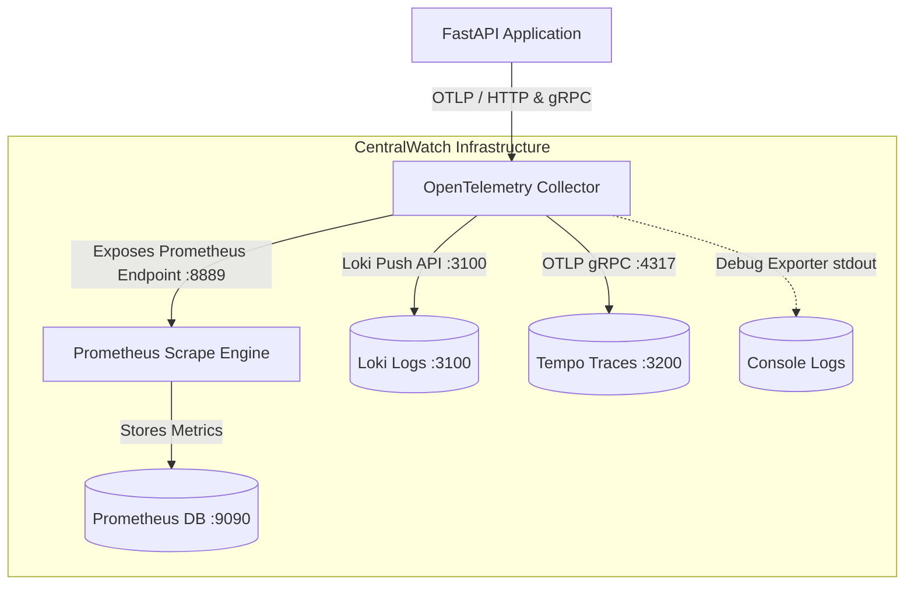

# CentralWatch Infrastructure

This repository contains the monitoring and observability infrastructure layer for **CentralWatch**, consisting of the **OpenTelemetry (OTel) Collector**, **Prometheus**, **Loki**, and **Tempo**.

The infrastructure is designed for high reliability, security, and extensibility, allowing other applications (such as FastAPI) to send telemetry data (metrics, logs, and traces) via OTLP. The OTel Collector fans out this data to their respective backends.

---

## Architecture Diagram



---

## Ports Mapping

| Component | Port | Protocol | Scope | Description |
| :--- | :--- | :--- | :--- | :--- |
| **OTel Collector** | `4317` | gRPC | External | OTLP telemetry ingestion endpoint. |
| **OTel Collector** | `4318` | HTTP | External | OTLP telemetry ingestion endpoint. |
| **OTel Collector** | `8889` | HTTP | Internal / External | Prometheus metrics scrape endpoint (read by Prometheus). |
| **Prometheus** | `9090` | HTTP | External | Prometheus Web UI and HTTP query API. |
| **Loki** | `3100` | HTTP | External | Loki HTTP API and Grafana datasource ready endpoint. |
| **Tempo** | `3200` | HTTP | External | Tempo HTTP ready and Search API datasource endpoint. |

---

## Telemetry Flow and Pipelines

The OpenTelemetry Collector executes the following telemetry pipelines:

### 1. Metrics Pipeline
- **Receivers**: Ingests OTLP data over gRPC (port `4317`) and HTTP (port `4318`).
- **Processors**:
  - `memory_limiter`: Checks memory footprint every `1s` to prevent Out-Of-Memory (OOM) failures by dropping data if usage goes above `75%`.
  - `batch`: Groups metrics into batches of up to `10240` events or every `5s`.
- **Exporters**:
  - `prometheus`: Exposes the processed metrics in Prometheus format at `http://otel-collector:8889/metrics`.
  - `debug`: Prints detailed logs to the console.

### 2. Logs Pipeline
- **Receivers**: Ingests OTLP data over gRPC (port `4317`) and HTTP (port `4318`).
- **Processors**:
  - Same `memory_limiter` and `batch` processors to maintain uniform resource control.
- **Exporters**:
  - `loki`: Ships logs to the Loki HTTP push endpoint `http://loki:3100/loki/api/v1/push`.
  - `debug`: Prints detailed logs to the console.

### 3. Traces Pipeline
- **Receivers**: Ingests OTLP data over gRPC (port `4317`) and HTTP (port `4318`).
- **Processors**:
  - Same `memory_limiter` and `batch` processors to maintain uniform resource control.
- **Exporters**:
  - `otlp/tempo`: Ships traces to the Tempo OTLP receiver endpoint `tempo:4317` over gRPC.
  - `debug`: Prints detailed logs to the console.

---

## Getting Started

### Prerequisites

- [Docker](https://docs.docker.com/) and [Docker Compose](https://docs.docker.com/compose/) installed.
- Bash shell (Git Bash/WSL on Windows, or native terminal on Linux/macOS).

### 1. Start the Stack

To build and launch the monitoring services in the background, execute:

```bash
./scripts/start.sh
```

### 2. Stop the Stack

To stop and tear down the services, run:

```bash
./scripts/stop.sh
```

---

## Verification & Health Check

The `scripts/healthcheck.sh` script executes deep health verification of all components:
1. Verifies that the Docker containers for the OTel Collector, Prometheus, Loki, and Tempo are all running.
2. Queries the OTel Collector metrics endpoint (`http://localhost:8889/metrics`).
3. Queries Prometheus readiness (`http://localhost:9090/-/healthy`).
4. Queries Loki readiness (`http://localhost:3100/ready`).
5. Queries Tempo readiness (`http://localhost:3200/ready`).
6. Queries the Prometheus HTTP API to verify the `otel-collector` scrape target is registered and health status is `up`.

Run the checks with:

```bash
./scripts/healthcheck.sh
```

---

## Ingest Testing (Manual Verification)

### Metrics Ingestion
You can send test OTLP metrics to the HTTP receiver using `curl`:

```bash
curl -X POST -H "Content-Type: application/json" \
  http://localhost:4318/v1/metrics \
  -d '{
    "resourceMetrics": [{
      "resource": {
        "attributes": [{
          "key": "service.name",
          "value": { "stringValue": "centralwatch-test-app" }
        }]
      },
      "scopeMetrics": [{
        "scope": { "name": "manual-test-sensor" },
        "metrics": [{
          "name": "centralwatch_sensor_reading",
          "description": "A sample metric to test OTLP ingestion",
          "sum": {
            "dataPoints": [{
              "asInt": "100",
              "timeUnixNano": "'$(date +%s)000000000'"
            }],
            "aggregationTemporality": 1,
            "isMonotonic": true
          }
        }]
      }]
    }]
  }'
```

Once submitted, you can query `centralwatch_sensor_reading` directly in Prometheus at [http://localhost:9090](http://localhost:9090).
