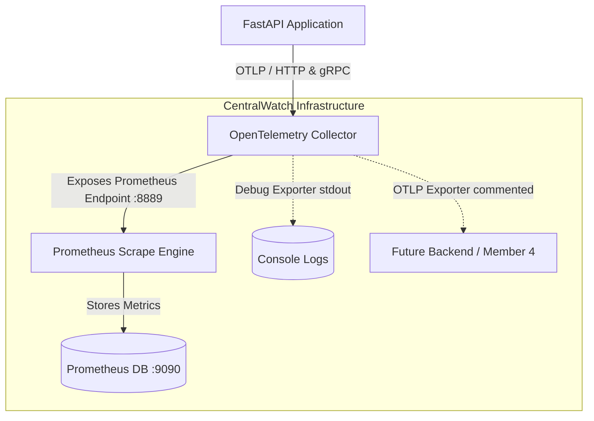

# CentralWatch Infrastructure

This repository contains the monitoring infrastructure layer for **CentralWatch**, consisting of the **OpenTelemetry (OTel) Collector** and **Prometheus**.

The infrastructure is designed for high reliability, security, and extensibility, allowing other applications (such as FastAPI) to send telemetry data via OTLP, which is then processed, scraped, and stored.

---

## Architecture Diagram



---

## Ports Mapping

| Component | Port | Protocol | Scope | Description |
| :--- | :--- | :--- | :--- | :--- |
| **OTel Collector** | `4317` | gRPC | External | OTLP telemetry ingestion endpoint. |
| **OTel Collector** | `4318` | HTTP | External | OTLP telemetry ingestion endpoint. |
| **OTel Collector** | `8889` | HTTP | Internal / External | Prometheus metrics scrape endpoint (read by Prometheus). |
| **Prometheus** | `9090` | HTTP | External | Prometheus Web UI and HTTP query API. |

---

## Collector Pipeline Configuration

The OpenTelemetry Collector executes the following telemetry flow:

1. **Receivers**: Ingests OTLP data over gRPC (port `4317`) and HTTP (port `4318`).
2. **Processors**:
   - `memory_limiter`: Checks memory footprint every `1s` to prevent Out-Of-Memory (OOM) failures by dropping data if usage goes above `75%`.
   - `batch`: Groups metrics into batches of up to `10240` events or every `5s` to reduce network round-trip overhead.
3. **Exporters**:
   - `prometheus`: Exposes the processed metrics in Prometheus format at `http://otel-collector:8889/metrics`.
   - `debug`: Writes detailed log output of received telemetry to container standard output for simple debugging and observability.
   - `otlp` (Preconfigured Template): Commented out by default to avoid connection failures, serving as a ready-to-use plug-and-play hook for Member 4's backend integration.

---

## Getting Started

### Prerequisites

- [Docker](https://docs.docker.com/) and [Docker Compose](https://docs.docker.com/compose/) installed on your machine.
- Bash shell (Git Bash/WSL on Windows, or native terminal on Linux/macOS).

### 1. Start the Stack

To build and launch the monitoring services in the background, execute:

```bash
./scripts/start.sh
```

### 2. Stop the Stack

To stop and tear down the services, run:

```bash
./scripts/stop.sh
```

---

## Verification & Health Check

The `scripts/healthcheck.sh` script does a deep health check of all components:
1. Verifies that the docker containers are active.
2. Queries the Collector metrics endpoint (`http://localhost:8889/metrics`) to verify it serves metrics properly.
3. Queries Prometheus readiness endpoint (`http://localhost:9090/-/healthy`).
4. Queries the Prometheus HTTP API to verify the `otel-collector` target is registered and reported as `up`.

Run it with:

```bash
./scripts/healthcheck.sh
```

---

## Ingest Testing (Manual Verification)

You can send test OTLP metrics to the HTTP receiver using `curl` to verify end-to-end functionality:

```bash
curl -X POST -H "Content-Type: application/json" \
  http://localhost:4318/v1/metrics \
  -d '{
    "resourceMetrics": [{
      "resource": {
        "attributes": [{
          "key": "service.name",
          "value": { "stringValue": "centralwatch-test-app" }
        }]
      },
      "scopeMetrics": [{
        "scope": { "name": "manual-test-sensor" },
        "metrics": [{
          "name": "centralwatch_sensor_reading",
          "description": "A sample metric to test OTLP ingestion",
          "sum": {
            "dataPoints": [{
              "asInt": "100",
              "timeUnixNano": "'$(date +%s)000000000'"
            }],
            "aggregationTemporality": 1,
            "isMonotonic": true
          }
        }]
      }]
    }]
  }'
```

Once submitted, you can search for `centralwatch_sensor_reading` directly in the Prometheus dashboard at [http://localhost:9090](http://localhost:9090).
